# Creating an ArcGIS StoryMap (Geocaching)
This guide is accompanied by the prepared images, narrative text and links provided from above. Download and unzip the folder containing the story map elements (StoryMapDemo.zip) before beginning. Each STEP below correlates to the STEP listed in the GEOCACHING.docx file. OPEN this Word file and keep it open for this tutorial.

a)	Using Google Chrome, go to [https://storymaps.arcgis.com/stories](https://storymaps.arcgis.com/stories)  
b)	Sign in using your Brock University credentials as described in the first minute of this video: [https://youtu.be/GqH4UHTUf2s](https://youtu.be/GqH4UHTUf2s)  
c)	Click +New Story > Start from scratch.  

### Step One
1.	Enter a title: GEOCACHING  
2.	Enter a subtitle: (GEE-OH-CASH-ING)  
3.	To add a background image to the title page, click ADD COVER IMAGE OR VIDEO and navigate to geocaching-title-page.jpg then select the image and click Add.  
4.	Click DESIGN at the top of the window and choose COVER > FULL  

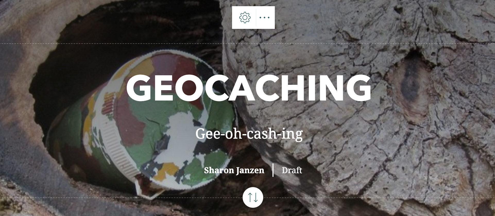  

5.	Scroll down and start to tell your story…  
6.	Click the plus sign to see the components available to add to your story.   

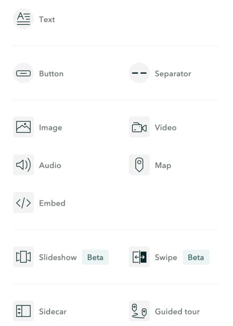  

### Step Two

1. Click the TEXT option and enter the type "The sport where YOU are the search engine!" 
2. To style it as a quote, highlight the text and select Quote from the dropdown list. Note: the quoted text will appear unique depending on the theme chosen for the storymap.   

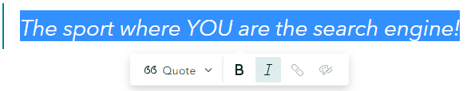

### Step Three
1.	Add Text “What is geocaching?” and format it as a Heading. 
2.	Now add a paragraph describing geocaching. With the details document open you can copy/paste the text into place.  

>Geocaching is a GPS-enabled treasure hunt played in over 190 countries across the world. In this game, outdoor enthusiasts follow GPS coordinates to explore new locations and find caches hidden by fellow geo-explorers in public spaces. If you find a cache, sign the log book, take a piece of the treasure, leave a piece of treasure then go home and post your experience on http://www.geocaching.com!!

3.	Highlight the URL, hit CTRL-C to copy it then select the link and hit CTRL-V to paste the URL.

### Step Four

1.	Add a video, copy and paste the video URL under the link tab.  

https://www.youtube.com/embed/vuFiLhhCNww
 
2.	Click Add.  

### Step Five

1.	To add an image, click  
2.	Browse to GPS.jpg and click Add.
3.	From the position options, choose float.  
4.	Click “Add a caption for this image (optional)” and enter the caption ‘GPS Navigation Satellite Schematic’
5.	Click the space to the right of the image (Continue your story…) and add a heading “What is GPS?”
6.	Hit Enter and start adding paragraph text. Copy/paste the paragraph from the DETAILS document. 

>GPS stands for Global Positioning System. This system represents a constellation of 30 satellites operated by the U.S. Department of Defense. These satellites travel in controlled orbits approximately 20,000 kilometres above the earth’s surface, making two complete rotations every day. The orbits are arranged so that at anytime, anywhere on Earth, there are at least four satellites “visible” in the sky. Each satellite transmits a complex radio signal including an extremely accurate time signal. Using a GPS receiver (from recreational devices to survey-grade instruments) satellite radio signals are received and simple trigonometry calculations determine a precise position on the earth’s surface. A minimum of 3 satellite signals is required but most GPS units can access up to 12 or more for increased accuracy. (https://en.wikipedia.org/wiki/Global_Positioning_System)
The result will look like this:

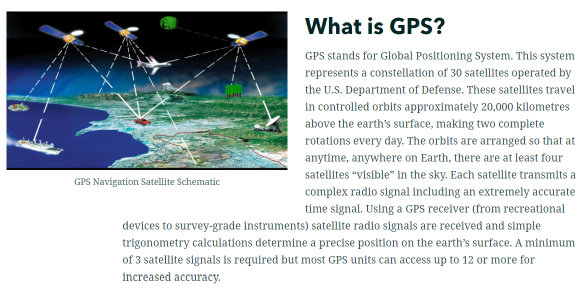  

### Step Six

1. Insert a heading: “What does a geocache look like?”
2.	Add paragraph text:
>Traditional geocaches require some sort of container for placing a logbook and/or various treasures for swapping. The original cache container mimicked the iconic metal ammo can but after nearly two decades of geocaching, all manner of container can be found!

3.	For those working from a subscription account, add embedded content: 
https://www.geocaching.com/blog/2019/11/the-evolution-of-geocaches/  
 
The content is displayed as a “card”. Viewers can click on the card to see more content.

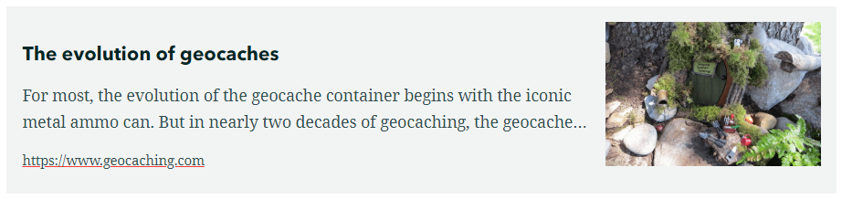 

4.	Alternately, add an image: Browse to *cache-containers.jpg* and add a caption describing the containers as follows:  
>Spider "Nano", Bubble Gum "Micro", Ammo box "Large", Peanut Butter Jar "Traditional"

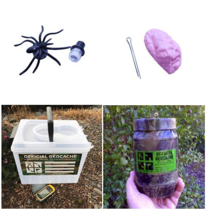

### Step Seven

1.	Insert **Slideshow Beta** allows you to share a series of related media (images, maps, videos). 
2.	Add 3 slides (click the plus at the bottom right of the window) using these media images (ThisIsAGeocache1.jpg, ThisIsAGeocache2.jpg, ThisIsAGeocache3.jpg)
NOTE: see the DETAILS document for slide title ideas.

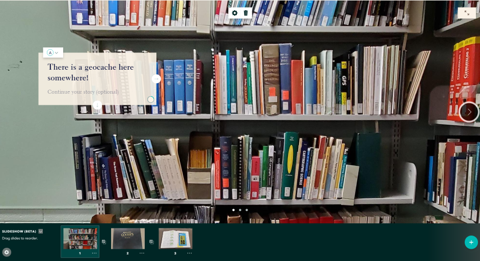

### Step Eight

1.	To continue with the story, scroll down past the slideshow content.
2.	Insert a Heading: “What’s in a geocache?”
3.	Add paragraph text:
>Each cache should contain a log book for you to sign and date. Depending on the size or type of cache, you may also find small trinkets to trade, instructions for another cache or maybe even a 'travel bug'!

4.	Add image (cache-prizes.jpg)

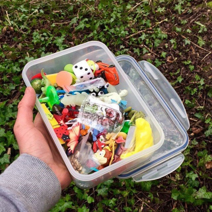

### Step Nine

1.	Insert a **sidecar**. This element uses a large media display on the right with narrative text and media available on the left (known as the ‘sidecar’). Select “Docked panel”.
2.	Add a Heading on the left: “Travel Bugs” with the following paragraph text describing travel bugs:
>Travel Bugs are items that have been tagged with a unique code (similar to 'dog tags') and given a purpose. For example, a travel might include a stuffy that wants to travel across Canada by all manner of transportation. If a geocacher grabs a Travel Bug they are agreeing to move the item along to another geocache taking it one step closer to its goal.

3.	Add an image to the sidecar ON THE LEFT (travel-bugs.jpg).
4.	For the large media display ON THE RIGHT, Click Add media > Add map 
5.	You will see a listing of maps owned by you OR you can simply select **NEW EXPRESS MAP** at the top right.
6.	Express Maps are created on-the-fly within the story map environment.

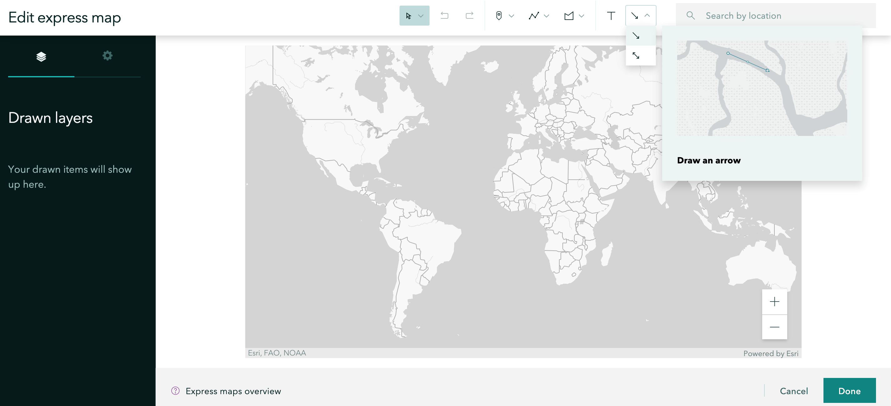

7.	You can add graphics to the map to highlight certain features. Draw an arrow over each continent since travel bugs go everywhere!
8.	Now use the place search tool at the top right of the map to search for *Wilberforce, Highlands East, Ontario*. This village is known as the geocaching capital of Canada. Select the appropriate result. The map zooms to Wilberforce. 
9.	Click *Add to map* to add a placemark at this location. 
10.	Details for the placemark popup appear to the left of the map window. Add an image (Wilberforce.jpg).
11.	Update the description to read “Geocaching Capital of Canada”. Highlight the text and add a link https://www.geocachingcapitalofcanada.com/ 
12.	Hit ENTER to apply the link. 

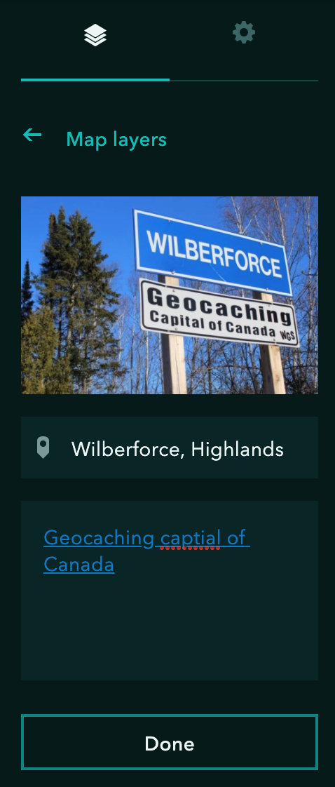

13.	Click Done.
14.	Zoom out to see the whole world.
15.	Click Done at the bottom right of the window.

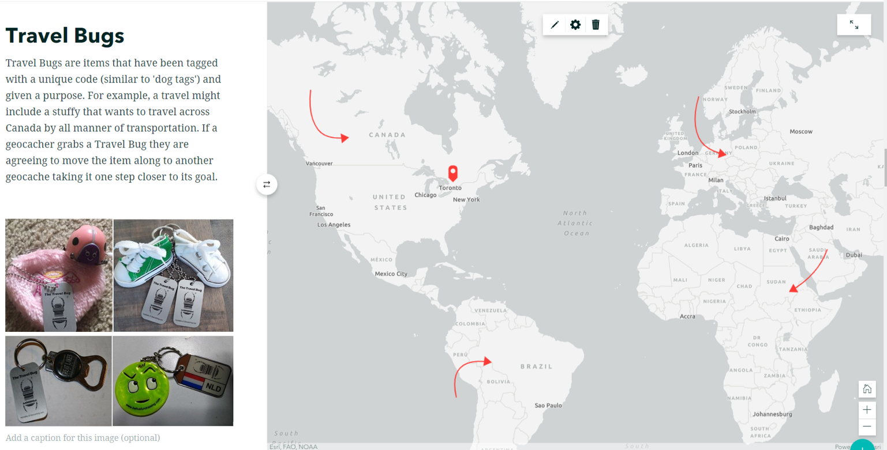

### Step Ten

1.	Scroll down BELOW the sidecar entry. Click +Continue your story... 
2.	Insert text and format as a heading: “Let’s play!”
3.	Insert embed: copy and paste the URL https://www.geocaching.com/play to create a card that users can click to access the official geocaching website.
4.	Insert Buttons for the app stores:
>Google Play Store https://play.google.com/store/apps/details?id=com.groundspeak.geocaching.intro&referrer=utm_source%3Dgeocaching-website%26utm_campaign%3DQ1-2018-update-logged-out-home-page
>Apple App Store https://itunes.apple.com/app/apple-store/id329541503?pt=61076&ct=Q1-2018-update-logged-out-home-page&mt=8 
   
   
 ### Step Eleven

1.	Insert a heading: “Sources”
2.	In a Paragraph section, copy and paste the list of sources:
>1.	The Evolution of Geocaches [blog post]. (November 19, 2019). Retrieved September 14, 2020 from https://www.geocaching.com/blog/2019/11/the-evolution-of-geocaches/
>2.	X Marks the Spot: What is geocaching and how does it work [blog post]. (December 12, 2018). Retrieved September 14, 2020 from https://mapscaping.com/blogs/geo-candy/what-is-geocaching-how-does-it-work
>3.	GEOCACHING [website]. (copyright 2000-2019). Retrieved September 14, 2020 from https://www.geocaching.com
>4.	Global Positioning Systems [website]. (November 25, 2019). Retrieved September 14, 2020 from https://en.wikipedia.org/wiki/Global_Positioning_System
>5.	A struggling town is reviving itself with… Geocaching [website]. (March 30, 2018). Retrieved September 14, 2020  from https://www.vice.com/en_us/article/qvxvq5/wilberforce-canada-stuggling-town-geocaching-capital
>6.	Getting Started with ArcGIS StoryMaps [website]. (October 30, 2019). Retrieved September 14, 2020 from https://storymaps.arcgis.com/stories/cea22a609a1d4cccb8d54c650b595bc4 
>7.	ArcGIS StoryMaps Frequently Asked Questions [website]. Retrieved September 14, 2020 from https://doc.arcgis.com/en/arcgis-storymaps/get-started/faq.htm

### STEP TWELVE
1.	Insert image (Brock-Aerial.jpg)
2.	Set it to medium width.
3.	Add a caption “Oh the places you’ll go with geocaching!”

### STEP THIRTEEN
1.	To tweak the design settings for the entire story, click the Design button at the top of the window.
2.	Under Theme, explore the options for accent colour, font pairings, etc.
3.	Other useful settings include activating NAVIGATION. This function lets users jump to specific headings in your story.

### STEP FOURTEEN
As you work to develop your story map, the interface automatically saves your changes to the ArcGIS Online cloud. You can click the Preview button at the top to see how your app will look on desktop, tablet or smartphone devices.
1.	When you are satisfied, click Publish to finish the story map process. You will notice the “checking for issues” window. When prompted, choose a sharing option and click Publish Story.
 
2.	To share your story map with friends, click the sharing options at the top right of the window  (NOTE: these sharing options will only be available when shared PUBLICLY)

### STEP FIFTEEN:
To access your stories in the future, go to https://storymaps.arcgis.com/stories and sign in using the same credentials you used to create the story map. You will see all your authored stories listed here.

#### STEP SIXTEEN - Continue Learning
•	Geocaching Story Map https://arcg.is/1Hv9Da  
•	Story Maps Overview https://bit.ly/2MRMQ7w  
•	Getting Started with StoryMaps https://bit.ly/2MTQ36F  
•	Digital Mapping Workshop https://bit.ly/38IkDZv  
•	Story + Maps: Part 1 https://arcg.is/uWTzC  
•	Story + Maps: Part 2 https://arcg.is/1rvf0X  
•	Explore Stories (examples) https://bit.ly/3882V1T  
•	Qualitative Research Café https://bit.ly/367v6fs  
•	Putting Your Research on the Map https://bit.ly/2RrxWb9  
•	Classic Story Map Templates https://bit.ly/33Z7Hf2  
•	Contact us maplib@brocku.ca or sjanzen@brocku.ca   

 
 
 -----------------------------------

  
**This tutorial is brought to you by the Brock University Digital Scholarship Lab.  For more information on the DSL check out our website at [www.brocku.ca/library/dsl/](https://brocku.ca/library/dsl/) or you can e-mail us at dsl@brocku.ca.**  
  
You can also find us on:  
[Facebook](https://www.facebook.com/Brock-University-Digital-Scholarship-Lab-349407235866792/)  
[Twitter](https://twitter.com/brock_dsl)  
[Instagram](https://www.instagram.com/brock_dsl/?hl=en)  
[YouTube](https://www.youtube.com/channel/UC2eEqPkDo-1N3qilxv-N_1g/featured?view_as=subscriber)

<!--- Please use reference style images so that it is easier to update pictures later --->

[imglogo]: INSERT LOGO FILENAME HERE
